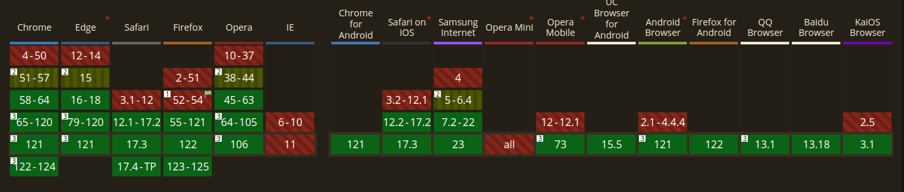

# Intersection Observer

## What is it?

Intersection Observer , observe changes in the intersection of a target element with an ancestor element or with a top-level document's viewport.
nowadays its a easy task because its handled by browser! but far far away from now (just kidding. i mean X years ago) we have a hard task because we must implements this thing by ourselves!
i mean something like this :

```js
//first we must collect some information
Element.getBoundingClientRect()
// then eventHandlers and loops and other things
// so all of this in main thread ?
// so our code gonna be awful and dirty
```

so thanks the browser...

## Why We Need To know About Intersection?

its useful in many places . for example : lazy-loading of images or other content as a page is scrolled | that means we fetch the images or other contents just when we need it . ofc when the user need it!
another use-case that i have to mention is "infinite scrolling". LLLIIINNKKK

## Why we haven't performance problems with Intersection Observer?

Intersection Observer lets code register a callback function that is executed whenever a particular element enters or exits an intersection with another element (or the viewport), or when the intersection between two elements changes by a specified amount. so browser no longer need to do anything on the main thread to watch for this kind of element intersection, and the browser is free to optimize the management of intersections as it sees fit.

## Let's make Our Hands Dirty

### Create

Create the intersection observer by calling its constructor and passing it a callback function

```js
const options = {
  root: document.querySelector('.scrollArea'),
  rootMargin: '0px',
  // it means when 100% of the target is visible within the element specified by the root option, the callback is invoked.
  threshold: 1.0,
}

const observer = new IntersectionObserver(callback, options)
```

### Lazy loading Images

```html
<!-- we have some example image  -->
<!-- we must load this images when we need it -->
<!-- in the src : we show the placeholder its low byte image  -->
<!-- and in the data-src we have real img address -->


```

```js
// first create !
// it take two arguments
// if you remember `const observer = new IntersectionObserver(callback, options)`
const observer = new IntersectionObserver(
  (entries, observer) => {
    // for all of them
    entries.forEach((entry) => {
      //if they are in the view and we reach the 200 px so
      // replace the placeholder with the real img
      entry.target.src = entry.target.dataset.src

      // and then unobserve  that img
      // we don't do any more with that specific image
      observer.unobserve(entry.target)
    })
  },
  // what this mean?
  // imagine a border on top of browser that has a 200 px distance from the top
  // i mean 200px above viewport
  { rootMargin: '0px 0px -200px 0px' }
)
```

### Auto-pause video when its out of view

```html
<video src="simple.mp4" controls=""></video>
```

```js
//first select the tag
const video = document.querySelector('video')

//its a flag
const isPaused = false

//so create the observer
const observer = new IntersectionObserver(
  (entries, observer) => {
    // for all of them
    entries.forEach((entry) => {
      //entry.intersectionRatio ?
      // if we reach the half of the wat its .5
      // and so on
      // if we have the video tag fully on the view its 1

      if (entry.intersectionRatio != 1 && !video.paused) {
        video.pause()
        isPaused = true
      } else if (isPaused) {
        video.play()
        isPaused = false
      }
    })
  },
  // this mean after the end of the video .
  //  i mean when the video tag in the outside of our view
  { threshold: 1 }
)
observer.observe(video)
```

## Huge Examples

### Changing Color Cube

```html
<section>
  <div class="content">
    <h1>scroll!</h1>
    <div id="box">
      <h1 class="vertical"></h1>
    </div>
  </div>
</section>
```

```css
section {
  height: 100dvh;
  display: grid;
  place-items: center;
}
.content {
  text-align: center;
  height: 100%;
  padding: 4rem;
}
#box {
  margin-top: 300%;
  background-color: rgb(40 40 190 / 100%);
  border: 4px solid rgb(20 20 120);
  transition: background-color 1s, border 1s;
  width: 350px;
  height: 350px;
  display: flex;
  align-items: center;
  justify-content: center;
  padding: 20px;
}

.vertical {
  color: white;
  font: 32px 'Arial';
}

.extra {
  width: 350px;
  height: 350px;
  margin-top: 10px;
  border: 4px solid rgb(20 20 120);
  text-align: center;
  padding: 20px;
}
```

```js
const numSteps = 20.0

let boxElement
let boxText
let prevRatio = 0.0
let increasingColor = 'rgb(40 40 190 / ratio)'
let decreasingColor = 'rgb(190 40 40 / ratio)'

// Set things up
window.addEventListener(
  'load',
  (event) => {
    boxElement = document.querySelector('#box')
    boxText = document.querySelector('.vertical')
    createObserver()
  },
  false
)

function createObserver() {
  let observer

  let options = {
    root: null,
    rootMargin: '0px',
    threshold: buildThresholdList(),
  }

  observer = new IntersectionObserver(handleIntersect, options)
  observer.observe(boxElement)
}

function buildThresholdList() {
  let thresholds = []
  let numSteps = 20

  for (let i = 1.0; i <= numSteps; i++) {
    let ratio = i / numSteps
    thresholds.push(ratio)
  }

  thresholds.push(0)
  return thresholds
}

function handleIntersect(entries, observer) {
  entries.forEach((entry) => {
    console.log(entry.intersectionRatio)
    if (entry.intersectionRatio > prevRatio) {
      boxText.textContent = 'we are going down'
      entry.target.style.backgroundColor = increasingColor.replace(
        'ratio',
        entry.intersectionRatio
      )
    } else {
      boxText.textContent = 'we are going Up'

      entry.target.style.backgroundColor = decreasingColor.replace(
        'ratio',
        entry.intersectionRatio
      )
    }

    prevRatio = entry.intersectionRatio
  })
}
```

### Cards

```html
<div class="card-container" id="scrollArea">
  <div class="card">This is first Card</div>
  <div class="card">This is a 1 Card</div>
  <div class="card">This is a 2 Card</div>
  <div class="card">This is a 3 Card</div>
  <div class="card">This is a 4 Card</div>
  <div class="card">This is a 5 Card</div>
  <div class="card">This is a 6 Card</div>
  <div class="card">This is a 7 Card</div>
  <div class="card">This is a 8 Card</div>
  <div class="card">This is a 9 Card</div>
  <div class="card">This is a 10 Card</div>
  <div class="card">This is a 11 Card</div>
  <div class="card">This is a 12 Card</div>

  <div class="card">This is the last Card</div>
</div>
```

```css
.card-container {
  display: flex;
  flex-direction: column;
  align-items: flex-start;
}

.card {
  border: 1px solid #000;
  display: block;
  margin: 10px;
  padding: 30px 10px;
  width: 400px;
  border-radius: 3px;
  transform: translateX(100px);
  opacity: 0;
  transition: 150ms;
  background: salmon;
  color: white;
}

.card.show {
  transform: translateX(0);
  opacity: 1;
}
```

```js
const cards = document.querySelectorAll('.card')
const observer = new IntersectionObserver(
  (entries) => {
    entries.forEach((entry) => {
      entry.target.classList.toggle('show', entry.isIntersecting)
    })
  },
  {
    threshold: 0.5,
  }
)
cards.forEach((card) => {
  observer.observe(card)
})
```

## Can I Use Intersection Observer?


